in progress...

beginning 
v1 and v3

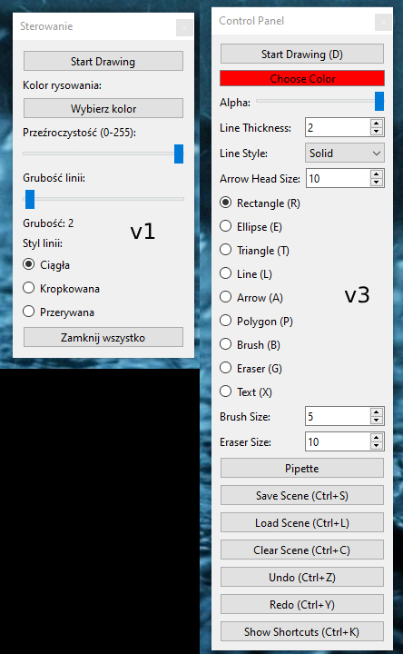

v61

v72
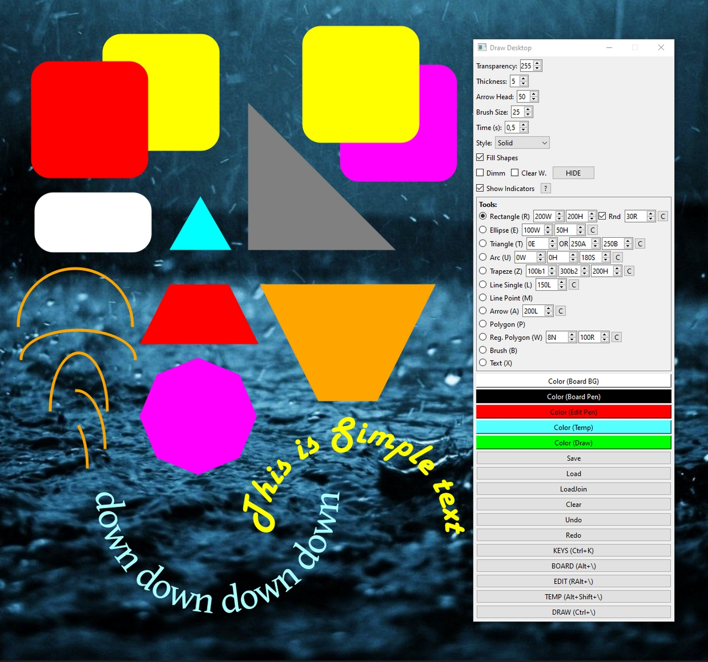

arrows and show angle option (v72)
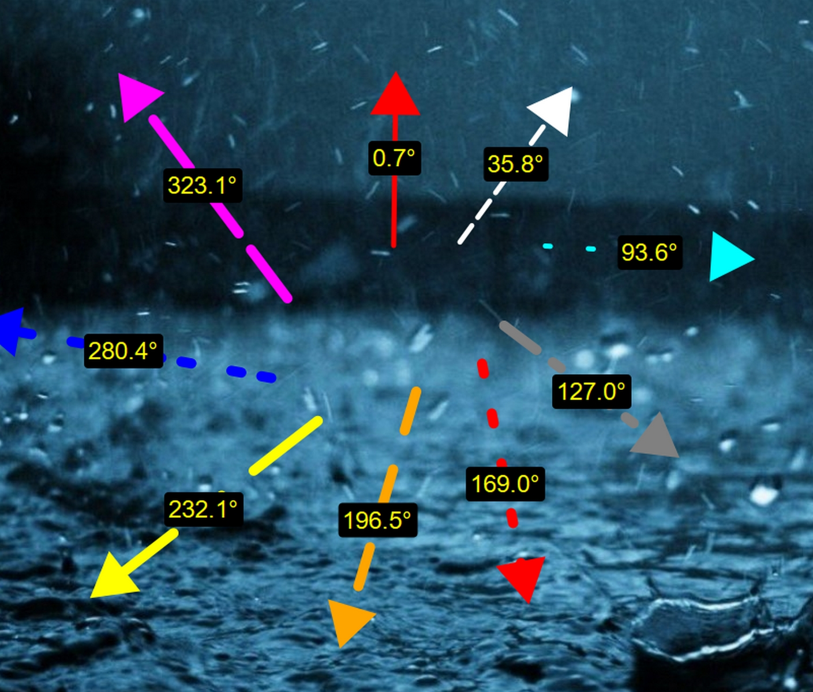

multiple point with automatic name (v75)
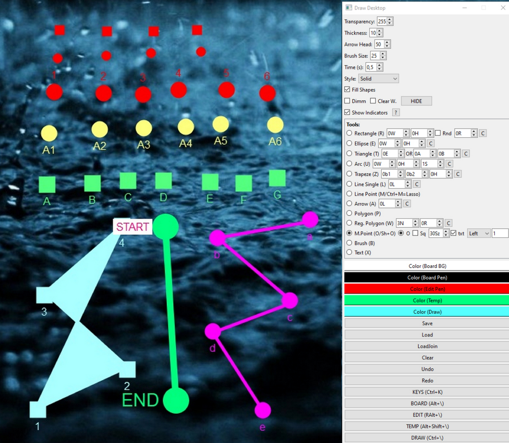

v81

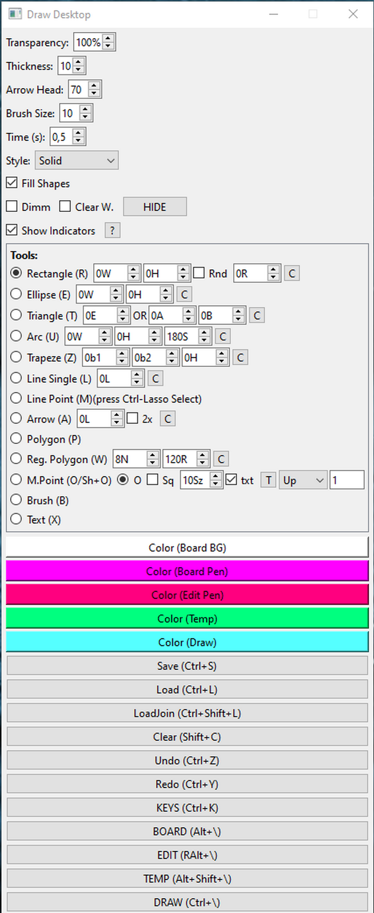

v91 (animation frame by frame)

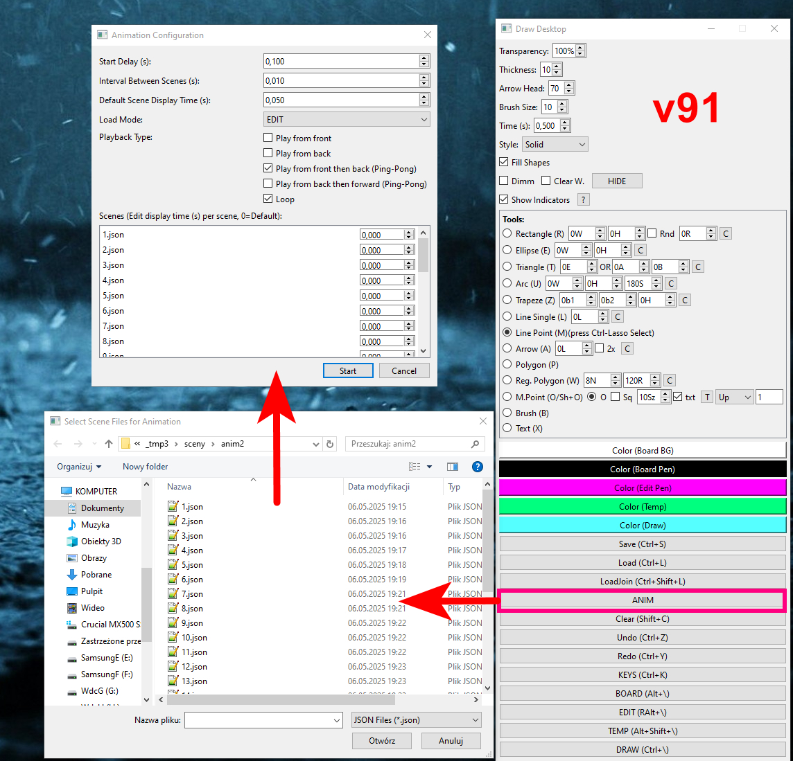

v91 animation1

v109

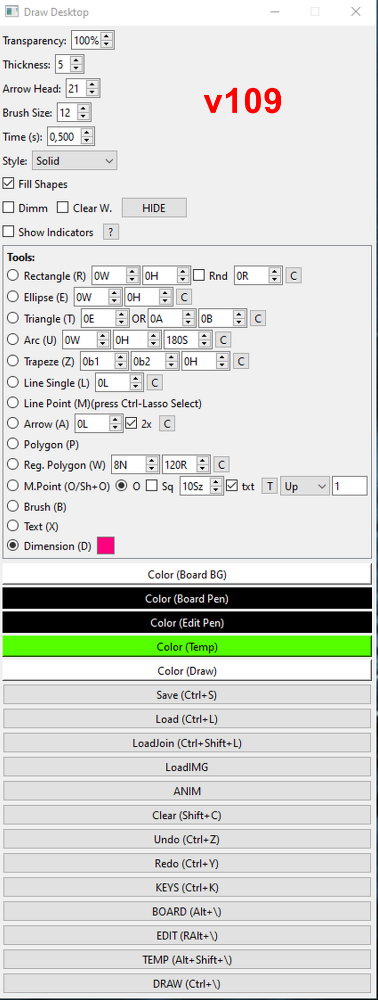

v109 draw on image

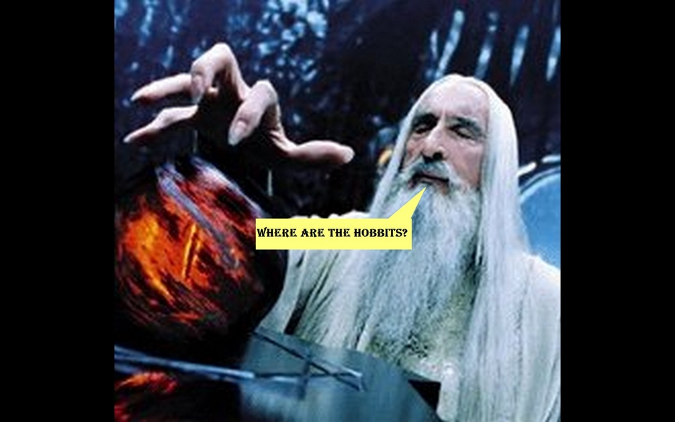

v109 dimension
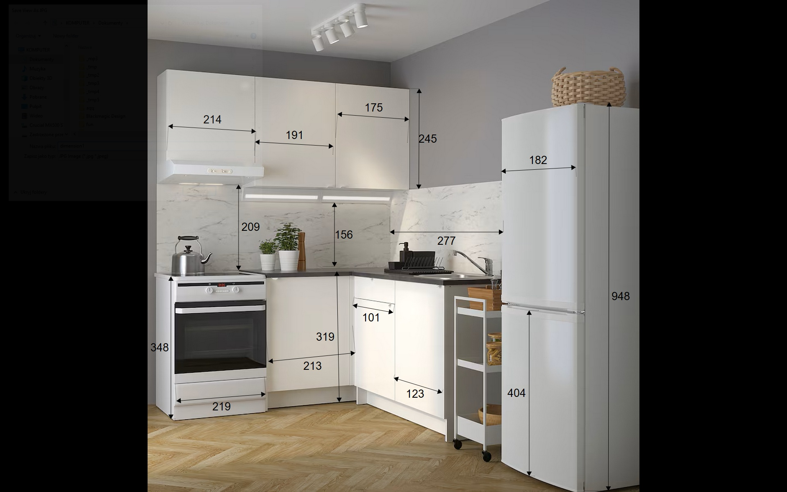

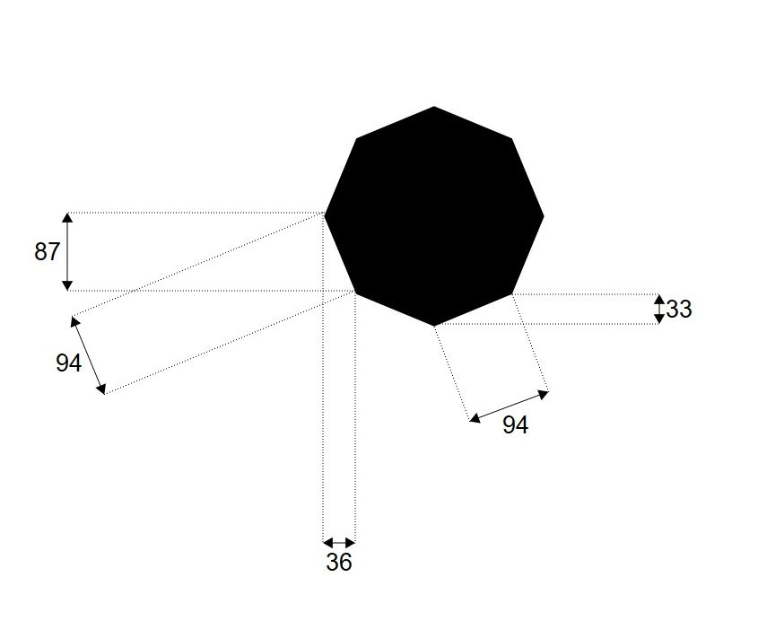

v117 animation new settings
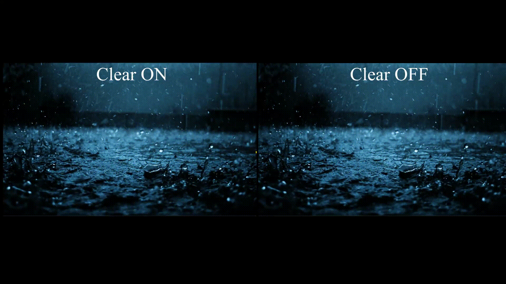

v137
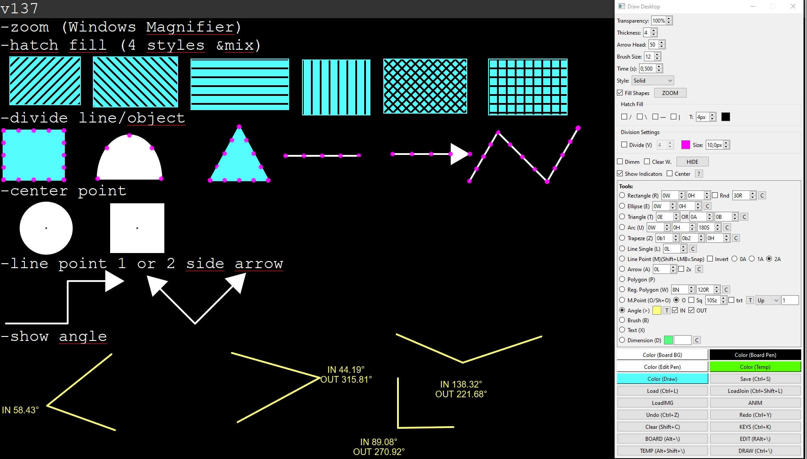

v140

-grouping of shapes

-spline Bézier curve

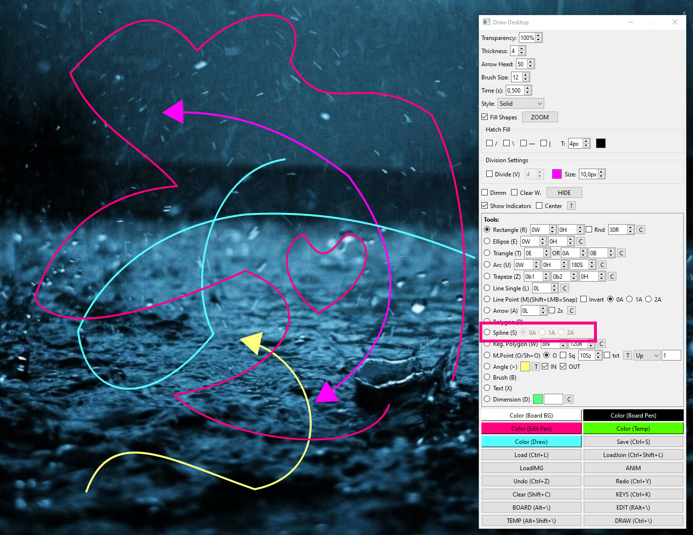

v154

More notifications info in left-up corner, Grip, Snap2Grip

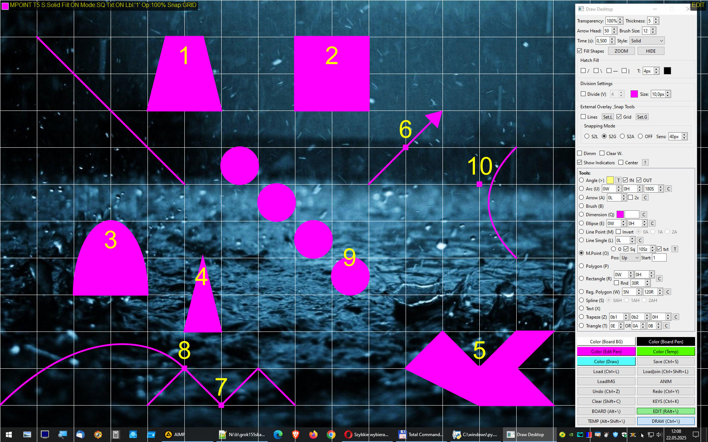

Own auxiliary lines (Rulers), Snap2Lines

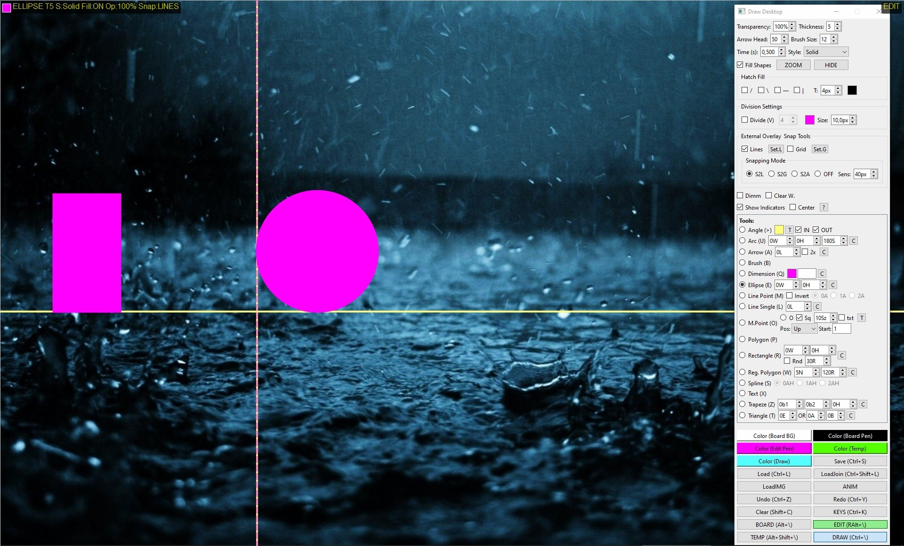

Snap2Point, save window position

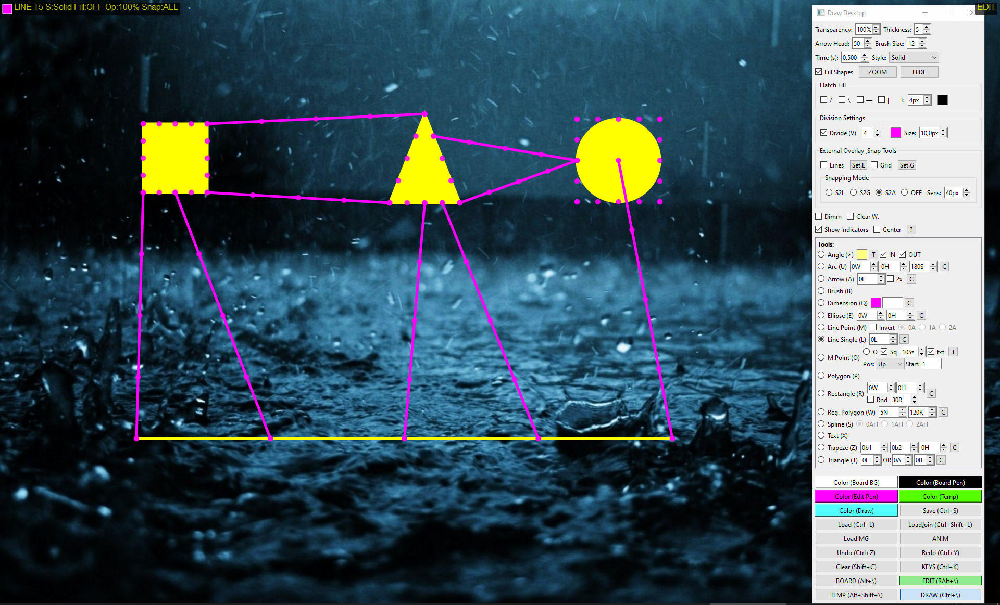
