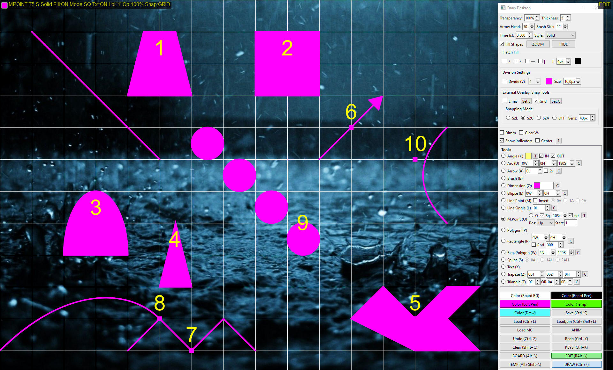

in progress...

************************************

Draw Desktop ENG

Draw Desktop is a versatile application that allows you to draw directly on your computer desktop or in dedicated whiteboard modes. The program offers a rich set of tools and customization options to support presentations, note-taking, annotations, or technical designs.

Key Features:

Draw Anywhere:

Normal Mode: Draw directly on your desktop, with an optional background dimming for better visibility.

BOARD Mode: A classic whiteboard with configurable background and pen colors.

EDIT Mode: Draw on a transparent background, perfect for annotating existing desktop elements or loaded images.

TEMP Mode: Create temporary annotations that automatically disappear after a set time.

Rich Toolset:

Basic Shapes: Rectangle (also with rounded corners), Ellipse, Triangle, Line, Arrow, Arc, Trapezoid, Polygon, Regular Polygon.

Advanced: Spline Curve (Bézier), Brush, Text, Dimensioning, Angle.

Measurement Points (M.Point) with markers and labels.

Extensive Customization Options:

Control transparency, line thickness, arrowhead size, brush size.

Selection of line styles (solid, dashed, dotted, etc.).

Fill shapes with solid color, gradient, or hatch patterns.

Precision and Drawing Aids:

Configurable Grid and Guide Lines with snapping options to lines, grid, or key points of existing shapes.

Visualization of shape segment division into equal parts.

Display of shape center points.

Integration with the Windows Magnifier system tool.

Scene Management and Animation:

Save and load drawing scenes in .json.

Load images as backgrounds for annotation.

Create animations from sequences of saved .json scenes, with control over display time, intervals, playback mode, and looping.

Usability:

Undo / Redo functions.

Globally hide/show all drawn elements.

Extensive keyboard shortcuts for most operations.

On-screen indicators for active mode, tool, and settings.

Draw Desktop is a powerful tool for anyone who needs to dynamically add visual information to their computer screen.

********************************************************************************************************************
Draw Desktop PL

Draw Desktop to wszechstronna aplikacja umożliwiająca rysowanie bezpośrednio na pulpicie komputera lub w dedykowanych trybach tablicy (whiteboard). Program oferuje bogaty zestaw narzędzi i opcji personalizacji, aby wspomóc prezentacje, tworzenie notatek, adnotacje czy projekty techniczne.

Kluczowe Funkcje:

Rysowanie Wszędzie:

Tryb Normalny: Rysuj bezpośrednio na pulpicie, z opcjonalnym przyciemnieniem tła dla lepszej widoczności.

Tryb BOARD: Klasyczna tablica z konfigurowalnym kolorem tła i pióra.

Tryb EDIT: Rysuj na przezroczystym tle, idealny do adnotacji na istniejących elementach pulpitu lub załadowanych obrazach.

Tryb TEMP: Twórz tymczasowe adnotacje, które znikają automatycznie po zadanym czasie.

Bogaty Zestaw Narzędzi:

Podstawowe kształty: Prostokąt (także z zaokrąglonymi rogami), Elipsa, Trójkąt, Linia, Strzałka, Łuk, Trapez, Wielokąt, Wielokąt Regularny.

Zaawansowane: Krzywa Spline (Bézier), Pędzel (Brush), Tekst, Wymiarowanie (Dimension), Kąt (Angle).

Punkty Pomiarowe (M.Point) ze znacznikami i etykietami.

Rozbudowane Opcje Personalizacji:

Kontrola przezroczystości, grubości linii, rozmiaru grotu strzałki, rozmiaru pędzla.

Wybór stylu linii (ciągła, kreskowana, kropkowana itp.).

Wypełnianie kształtów kolorem jednolitym, gradientem lub wzorami kreskowania (hatch).

Precyzja i Wsparcie Rysowania:

Konfigurowalna Siatka (Grid) i Linie Pomocnicze (Guide Lines) z opcjami przyciągania (Snapping) do linii, siatki lub punktów kluczowych istniejących kształtów.

Wizualizacja podziału segmentów kształtów na równe części.

Wyświetlanie punktów centralnych kształtów.

Integracja z systemowym narzędziem Lupa Windows.

Zarządzanie Sceną i Animacja:

Zapisywanie i wczytywanie scen rysunkowych w formacie .json.
Wczytywanie obrazów jako tło do adnotacji.

Tworzenie animacji z sekwencji zapisanych scen .json, z kontrolą czasu wyświetlania, przerw, trybu odtwarzania i zapętlania.

Użyteczność:

Funkcje Cofnij (Undo) / Ponów (Redo).

Globalne ukrywanie/pokazywanie wszystkich narysowanych elementów.

Obszerne skróty klawiaturowe dla większości operacji.

Wskaźniki ekranowe informujące o aktywnym trybie, narzędziu i ustawieniach.

Draw Desktop to potężne narzędzie dla każdego, kto potrzebuje dynamicznie dodawać wizualne informacje na ekranie swojego komputera.
************************************************************************************************************************************

beginning 
v1 and v3

v61

v72

arrows and show angle option (v72)

multiple point with automatic name (v75)

v81

v91 (animation frame by frame)

v91 animation1

v109

v109 draw on image

v109 dimension

v117 animation new settings

v137

v140

-grouping of shapes

-spline Bézier curve

v154

More notifications info in left-up corner, Grip, Snap2Grip

Own auxiliary lines (Rulers), Snap2Lines

Snap2Point, save window position

v155 

add EXIT button, add "dark mode" and fix end process on exit)

